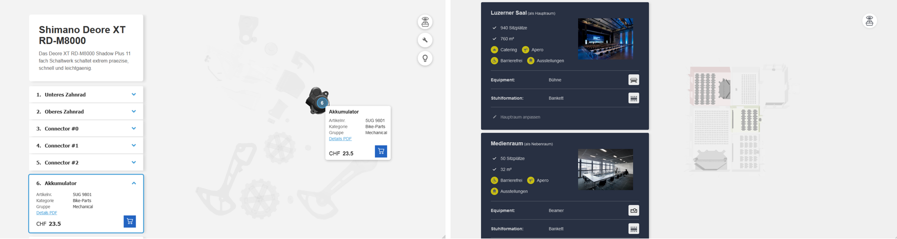
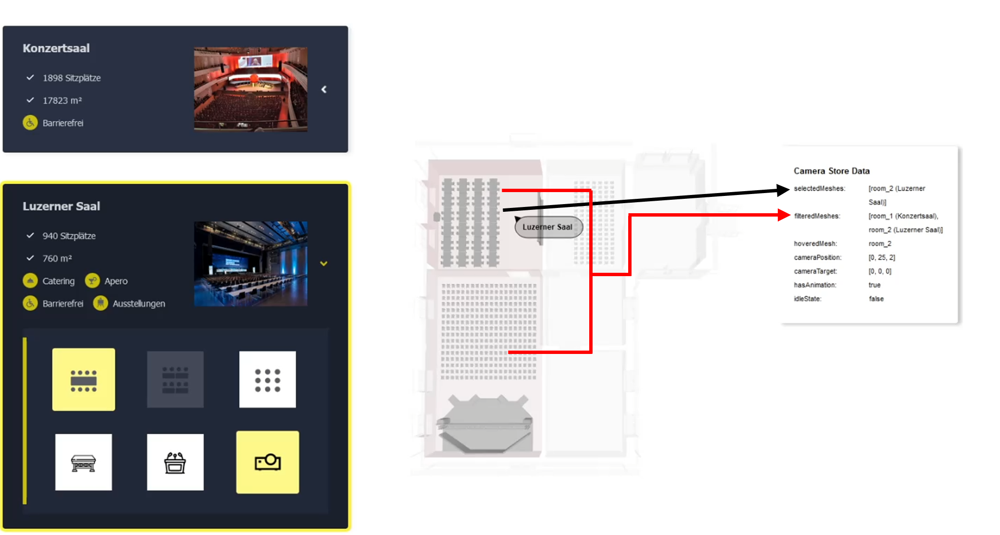
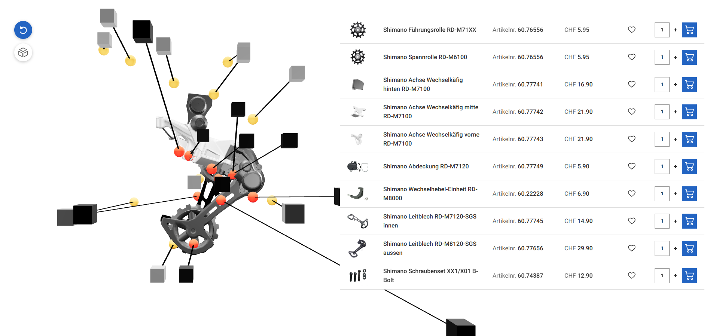

# Extra info regarding projects

**main**: KKL
**feature/shimano-simplified**: Explosive View

# KKL-3D-Prototype

# **node & npm Version**

In Node.js v17, the Node.js developers closed a security hole in the SSL provider. This fix was a breaking change that corresponded with similar breaking changes in the SSL packages in NPM. When you attempt to use SSL in Node.js v17 or later without also upgrading those SSL packages in your package.json, then you will see this error.
Currently this project can only be used with a node version <=17.
(used version for developing and testing: node: v16.20.2, npm: 8.19.4).

# **Projects**

- There are **_two projects_** in this repository, which are both based on similar packages and therefore originated in the same repo.
- The two projects are placed in the two branches: **_"kkl-room-configurator"_** and **_"shimano-explosive-view"_**.
- The branches "main" and "kkl-room-configurator" currently contain the same code and are identical.
- The branch "shimano-explosive-view" is a simplification of the branch "main"/"kkl-room-configurator". However, the branch "shimano-explosive-view" shows some new features and adjustments, which are not in "main"/"kkl-room-configurator". Some of them are: explosive-view-animation, resizable-3d-model-window for mobile and tablet, more interaction possibilities, UI design adapted to Cando Image GmbH Branding.


Shimano-Explosive-View (left) and KKL-Room-Configurator (right) Preview

# **Foreword**

This repository shows a feasibility study of the use of 3D rendering on the web for the selection and configuration of event spaces using the example "KKL Luzern". For the realization of the interactive 3D model of the building and its configurable rooms mainly the packages React-Three-Fiber and React-Drei were used.

## **IMPORTANT**

### **This is the reduced software documentation.**

**You can find the complete detailed documentation
<a href="./kkl-3d-prototype/public/readme/technicalSoftwareDocumentation.pdf">here</a> (currently only in german)**

The complete documentation describes the topics listed here in much more detail and covers other topics like issues and solutions, naming conventions, the glTF model hierarchy, the logic behind the camera movement, the logic of the 3D model interactions and the interactions between the wizard and the model and vice versa, the toggling of mesh visibility, the state management with zustand, performance optimizations, outlooks and ideas for improvement as well as other important topics for further development and understanding of the code.

Furthermore, there is an optional, non-technical project documentation, which describes the background behind the project, the initial requirements, idea and the goal of the project as well as the figma prototype and the useability tests and their results. The knowledge of the non-technical project documentation is not needed, to understand the code. </br>
You can find it <a href="./kkl-3d-prototype/public/readme/projectDocumentation.pdf">here</a> (currently only in german). </br>

# **Installation**

1. Clone the repository

```bash
git clone <https://github.com/4realDev/KKL-3D-Prototype.git>
```

2. Install npm packages

```bash
npm install
```

3. Run the repository locally under localhost:3000

```bash
npm run start / yarn start
```

4. Build the repository

```bash
npm run build / yarn build
```

# **Debugging**

In the project, during development, some debug options were developed in the UI, which can be enabled and disabled using checkboxes. These debug options are controlled by the DebugControlPanel.tsx class in the RoomSelection.tsx component. If you don't need them and want to hide them, you have to comment out lines 178-180 in RoomSelection.tsx (code snippet below).

```html
<div className="{styles.card}">
	<DebugControlPanel />
</div>
```

# **File structure**

```bash
.
│   .gitignore
│   package-lock.json
│   package.json
│   tsconfig.json
│   yarn.lock
│
├───public
│   │   favicon.ico
│   │   index.html
│   │   logo192.png
│   │   logo512.png
│   │   manifest.json
│   │
│   ├───images
│   │       Auditorium.jpg
│   │       BusinessMedienraeume.jpg
│   │       Clubraeume.jpg
│   │       EingangsFoyer.jpg
│   │       Konzertsaal.jpg
│   │       LuzernerSaal.jpg
│   │
│   └───model
│           house-model.glb
│
└───src
    │   App.js
    │   App.scss
    │   index.css
    │   index.js
    │   react-app-env.d.ts
    │   theme.tsx
    │
    ├───components
    │   ├───blocks
    │   │   ├───ModelCanvas
    │   │   │       ModelCanvas.module.scss
    │   │   │       ModelCanvas.tsx
    │   │   │
    │   │   └───RoomSelection
    │   │           RoomSelection.module.scss
    │   │           RoomSelection.tsx
    │   │
    │   ├───debug
    │   │   ├───DebugControlPanel
    │   │   │       DebugControlPanel.module.scss
    │   │   │       DebugControlPanel.tsx
    │   │   │
    │   │   ├───ThreeJsDataDebugger
    │   │   │       ThreeJsDataDebugger.module.scss
    │   │   │       ThreeJsDataDebugger.tsx
    │   │   │
    │   │   └───WizardDataDebugger
    │   │           WizardDataDebugger.module.scss
    │   │           WizardDataDebugger.tsx
    │   │
    │   ├───icons
    │   │       Accessibility.tsx
    │   │       Apero.tsx
    │   │       Beamer.tsx
    │   │       Catering.tsx
    │   │       ChairFormationBankett.tsx
    │   │       ChairFormationConcert.tsx
    │   │       ChairFormationSeminar.tsx
    │   │       CheckMark.tsx
    │   │       Chevron.tsx
    │   │       Edit.tsx
    │   │       EmptySearch.tsx
    │   │       Exhibition.tsx
    │   │       NoSeats.tsx
    │   │       Notification.tsx
    │   │       Overview.tsx
    │   │       Podium.tsx
    │   │       Seats.tsx
    │   │       Stage.tsx
    │   │
    │   ├───threeJs
    │   │       CameraControls.tsx
    │   │       CameraPositionMarkers.tsx
    │   │       Lights.tsx
    │   │       Model.tsx
    │   │
    │   ├───ui
    │   │   ├───Accordion
    │   │   │       Accordion.module.scss
    │   │   │       Accordion.tsx
    │   │   │
    │   │   ├───AccordionItem
    │   │   │       AccordionItem.module.scss
    │   │   │       AccordionItem.tsx
    │   │   │
    │   │   ├───Cursor
    │   │   │       Cursor.tsx
    │   │   │
    │   │   ├───EditButton
    │   │   │       EditButton.module.scss
    │   │   │       EditButton.tsx
    │   │   │
    │   │   ├───MeshVisibilityButton
    │   │   │       MeshVisibilityButton.module.scss
    │   │   │       MeshVisibilityButton.tsx
    │   │   │
    │   │   ├───NoResults
    │   │   │       NoResults.module.scss
    │   │   │       NoResults.tsx
    │   │   │
    │   │   └───RoomCard
    │   │           RoomCard.module.scss
    │   │           RoomCard.tsx
    │   │
    │   └───wizard
    │       ├───RoomFilteringWizard
    │       │       RoomFilteringWizard.module.scss
    │       │       RoomFilteringWizard.tsx
    │       │
    │       ├───RoomMainSelectionWizard
    │       │       RoomMainSelectionWizard.tsx
    │       │
    │       ├───RoomSideSelectionWizard
    │       │       RoomSideSelectionWizard.tsx
    │       │
    │       └───RoomSummaryWizard
    │               RoomSummaryWizard.module.scss
    │               RoomSummaryWizard.tsx
    │
    ├───data
    │       roomData.ts
    │
    ├───hooks
    │       useLongPress.ts
    │       useWindowDimensions.ts
    │
    ├───store
    │       useCameraStore.ts
    │       useDebugStore.ts
    │       useMeshStore.ts
    │       useWizardStore.ts
    │
    ├───styles
    │       colors.scss
    │       viewport.scss
    │
    └───utils
            room.tsx
```

# **Converting GLTF-File into own, global accessive, state-based data structure**

The original set of mesh information in the original glTF model, as shown in the first code snipped below or in , has been reduced for rendering and for interaction to the information shown in second code snippet below. This information is stored in a list (meshList: MeshObjectType[]), which is globally accessible as a state via the useMeshStore.ts store, so that interactions with the mesh can also be triggered outside the model. All meshes, whether child mesh or not, have this interface.

##### **Object3D class of individual mesh objects in the original data model from the GLTF file:**

```typescript
export class Object3D {
    id: number;
    uuid: string;
    name: string;
    type: string;
    parent: Object3D | null;
    children: Object3D[];
    up: Vector3;
    readonly position: Vector3;
    readonly rotation: Euler;
    readonly quaternion: Quaternion;
    readonly scale: Vector3;
    readonly modelViewMatrix: Matrix4;
    readonly normalMatrix: Matrix3;
    matrix: Matrix4;
    matrixWorld: Matrix4;
    matrixAutoUpdate: boolean;
    matrixWorldNeedsUpdate: boolean;
    layers: Layers;
    visible: boolean;
    castShadow: boolean;
    receiveShadow: boolean;
    frustumCulled: boolean;
    renderOrder: number;
    animations: AnimationClip[];
    userData: { [key: string]: any };
    customDepthMaterial: Material;
    customDistanceMaterial: Material;
    readonly isObject3D: true;
    *// Methods, Functions and EventHandlers ...*
}
```

##### **MeshObjectType Interface of the reduced information of the own reduced data model from the GLTF file, relevant for interaction and rendering:**

```typescript
export type MeshObjectType = {
	name: string;
	geometry: THREE.BufferGeometry;
	position?: THREE.Vector3;
	rotation?: THREE.Euler;
	scale?: THREE.Vector3;
	material: THREE.Material;
	color: string;
	opacity: number;
	isVisible: boolean;
	userData?: Record<string, string>;
	children?: MeshObjectType[];
};
```

# **Connection between the wizard and the 3d model**

The lower Figure shows the 3D model with the main room selected. The ThreeJsDataDebugger is activated and shows the currently selected filteredMeshes and selectedMeshes. In the wizard as well as in the model the Lzernen Saal (room_2) was selected as the active room and therefore added to the selectedMeshes array. Additionally, the two rooms Luzerner Saal and Konzertsaal remained after filtering and were therefore added to the filteredMeshes array.



# **Camera movement after interactions**

Each room has a room specific camera position (model.camPos) and a room specific camera target point (model.camTarget). This is used to ensure that each room has its own individual close-up view, which is displayed as soon as the room is selected in the room list or clicked on in the 3D model. This view allows the user to better see the room and its room details in the 3D model. In the figure below, the camPos and camTarget are shown using Cube and Sphere meshes by using the CameraPositionMarkers Option from the DebugControlPanel.tsx. The Cube is the camera and looks towards the Sphere Mesh, which is the target.


