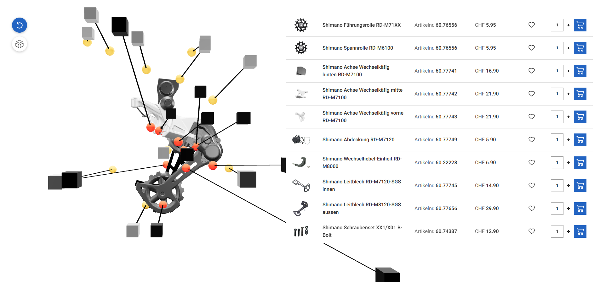

# Shimano 3D Exploded View

## Preview URL
[https://brazhnik.de/room-configurator/](https://brazhnik.de/exploded-view/)

# **node & npm Version**

In Node.js v17, the Node.js developers closed a security hole in the SSL provider. This fix was a breaking change that corresponded with similar breaking changes in the SSL packages in NPM. When you attempt to use SSL in Node.js v17 or later without also upgrading those SSL packages in your package.json, then you will see this error.
Currently this project can only be used with a node version <=17.
(used version for developing and testing: node: v16.20.2, npm: 8.19.4).

# **Foreword**

This repository shows a feasibility study of the use of 3D rendering on the web for a shimano gear shift. For the realization of the interactive 3D model and its exploded view mainly the packages React-Three-Fiber and React-Drei were used.

Technologies:
- ReactJS (Framework)
- React-Three-Fiber/React-Drei/ThreeJS (3D rendering and web animation)
- Zustand (State Management)
- SASS (Styling)
- MUI (Component UI-Library)

# **Installation**

1. Clone the repository

```bash
git clone <https://github.com/4realDev/KKL-3D-Prototype.git>
```

2. Install npm packages

```bash
npm install
```

3. Run the repository locally under localhost:3000

```bash
npm run start / yarn start
```

4. Build the repository

```bash
npm run build / yarn build
```

# **Converting GLTF-File into own, global accessive, state-based data structure**

The original set of mesh information in the original glTF model, as shown in the first code snipped below or in , has been reduced for rendering and for interaction to the information shown in second code snippet below. This information is stored in a list (meshList: MeshObjectType[]), which is globally accessible as a state via the useMeshStore.ts store, so that interactions with the mesh can also be triggered outside the model. All meshes, whether child mesh or not, have this interface.

##### **Object3D class of individual mesh objects in the original data model from the GLTF file:**

```typescript
export class Object3D {
    id: number;
    uuid: string;
    name: string;
    type: string;
    parent: Object3D | null;
    children: Object3D[];
    up: Vector3;
    readonly position: Vector3;
    readonly rotation: Euler;
    readonly quaternion: Quaternion;
    readonly scale: Vector3;
    readonly modelViewMatrix: Matrix4;
    readonly normalMatrix: Matrix3;
    matrix: Matrix4;
    matrixWorld: Matrix4;
    matrixAutoUpdate: boolean;
    matrixWorldNeedsUpdate: boolean;
    layers: Layers;
    visible: boolean;
    castShadow: boolean;
    receiveShadow: boolean;
    frustumCulled: boolean;
    renderOrder: number;
    animations: AnimationClip[];
    userData: { [key: string]: any };
    customDepthMaterial: Material;
    customDistanceMaterial: Material;
    readonly isObject3D: true;
    *// Methods, Functions and EventHandlers ...*
}
```

##### **MeshObjectType Interface of the reduced information of the own reduced data model from the GLTF file, relevant for interaction and rendering:**

```typescript
export type MeshObjectType = {
	name: string;
	geometry: THREE.BufferGeometry;
	position?: THREE.Vector3;
	rotation?: THREE.Euler;
	scale?: THREE.Vector3;
	material: THREE.Material;
	color: string;
	opacity: number;
	isVisible: boolean;
	userData?: Record<string, string>;
	children?: MeshObjectType[];
};
```

# **Camera movement after interactions**

Each room has a room specific camera position (model.camPos) and a room specific camera target point (model.camTarget). This is used to ensure that each room has its own individual close-up view, which is displayed as soon as the room is selected in the room list or clicked on in the 3D model. This view allows the user to better see the room and its room details in the 3D model. In the figure below, the camPos and camTarget are shown using Cube and Sphere meshes by using the CameraPositionMarkers Option from the DebugControlPanel.tsx. The Cube is the camera and looks towards the Sphere Mesh, which is the target.


